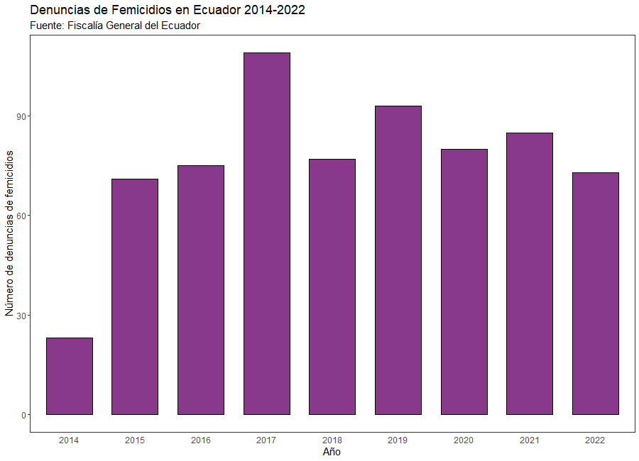
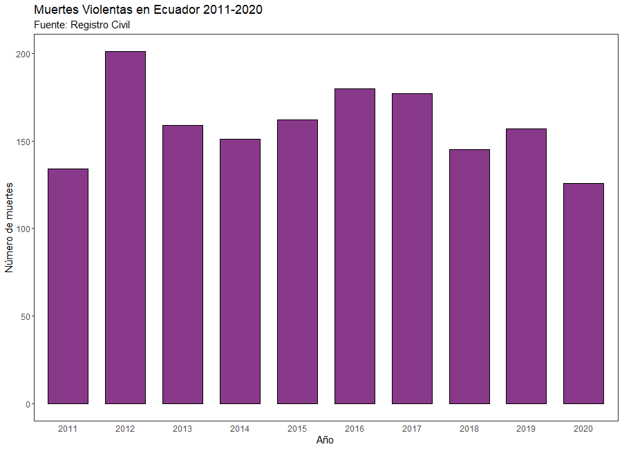

```{r setup, include=FALSE}
# Opciones para todos los chunks
knitr::opts_chunk$set(echo = TRUE)
```

# Muertes Violentas de Mujeres en Ecuador


En la actualidad existe un recuento de las muertes violentas de las mujeres desde agosto 2014, año en el que se tipificó el delito de femicidio en el Código Orgánico Integral Penal (COIP) - cuerpo de ley que regula el poder punitivo del estado ecuatoriano [@códigoo] - hasta finales de 2022, momento en el que los autores recuperaron los datos del gráfico de arriba del [reporte](https://www.fiscalia.gob.ec/analitica-muertes-de-mujeres-en-contexto-delictivo/) presentado periódicamente por el Consejo Nacional de Igualdad de Género [-@fiscalía].

Estas cifras separan las muertes de mujeres en dos categorías diferentes, siendo una los *femicidios*, un delito introducido en el COIP de 2014, artículo 141: "la persona que, como resultado de relaciones de poder manifestadas en cualquier tipo de violencia, dé muerte a una mujer por el hecho de serlo o por su condición de género"[^1].

[^1]: Recuperado de la base metodológica del reporte periódico del Consejo Nacional de Igualdad de Género [-@fiscalía].

La minoría de muertes violentas de mujeres durante el período estudiado por el Gobierno constituye este delito, quizás debido a la dificultad de la categorización de la muerte violenta de una mujer como un femicidio. La definición del delito en el COIP sitúa al femicidio como un crimen de odio contra la mujer *por el hecho de serlo*, sin embargo, al ser practicamente imposible conocer con certeza los motivos del criminal, los agentes de la ley se han centrado en aspectos conductuales y sentimentales de las víctimas y/o victimarios para poder sentenciar a los femicidas [-@fiscalía]. Por esta razón sería adecuado considerar que las cifras de femicidios reportados por el gobierno pueden estar considerablemente subestimados, por lo que es natural observar las cifras de muertes violentas de mujeres que no han sido categorizados como femicidios.

El primer gráfico también contempla las cifras de muertes de mujeres en contexto delictivo en categorías ajenas al femicidio. De acuerdo con el reporte, estos datos constituyen a aquellas muertes de mujeres por "homicidios intencionales"[^2], asesinato, sicariato, robo, ejecución extrajudicial, secuestro extorsivo, abandono de persona, violación, acto de odio, abigeato, extralimitación en un acto de servicio, entre otros. Bajo esta aclaración, sería posible llegar a la conclusión que dada la dificultad de la sentencia de un femicidio, buena parte de los *femicidios reales* podrían estar contenidos dentro de esta cifra, pero no podemos saber en qué proporción. Sin embargo, un dato importante es que el año 2022, sin haberse terminado, presenta notables **porcentajes de crecimiento anual** respecto a años anteriores, lo que sugeriría que ha sido un año especialmente violento (o con un número especialmente alto de *denuncias* de muertes de mujeres). Este preocupante hallazgo preliminar abre el camino a varias preguntas importantes sobre la manera en la que el Ecuador maneja la información sobre delitos violentos y cómo se la utiliza (si ha alguna vez se ha usado) para generar política pública.

[^2]: Según el reporte del Gobierno, se considera un homicidio intencional a ¨la muerte ilícita causada a una persona con la intención de causarle la muerte o lesiones graves"[@analític2022].

# El Problema Estadístico y de Rendición de Cuentas Institucional

La posibilidad de que el 2022 con diez meses transcurridos sea el año más violento del Ecuador para las mujeres definitivamente amerita un análisis más profundo, sin embargo, el reporte del Consejo Nacional de Igualdad de Género no provee accesso directo a los datos ni un documento exhaustivo sobre la metodología de su elaboración al presentar esta información en un dashboard. Debido a esto, acudimos al Ministerio de Gobierno (<http://cifras.ministeriodegobierno.gob.ec/comisioncifras/inicio.php>) para revisar los datos que presentan acerca de femicidios, donde encontramos que estaban disponibles bases con información sobre robos y homicidios intencionales. Al acceder a la base de homicidios, encontramos que estos se encuentran classificados como asesinato, homicidio, sicariato y femicidio. Al tomar únicamente los datos de tipo de muerte "femicidio" sólo consta información desde el 2014, donde se empezó a utilizar este término. Sin embargo, al utilizar este filtro nos encontramos con el problema que todos los femicidios fueron clasificados con sexo "no determinado" y cuando buscamos información de sexo "femenino" tenemos información de tipo de muerte "homicidio" y "asesinato". Con esto podemos determinar que no existen consistencias en la información de estas bases de datos, lo cual es alarmante ya que sugiere que el registro de estos datos no se está tomando con la seriedad debida y este tipo de datos limitan la realización de estudios e investigaciones que ayuden a construir política pública que ayude con la prevención y correcto manejo de los casos de femicidios. Al unir los datos de muertes violentas de mujeres de esta base, logramos encontrar que el número de muertes coincide con la información del Consejo Nacional de Igualdad de Género.

Por este motivo, hemos acudido a otras fuentes con el objetivo de tener una mejor visibidad acerca de la situación en el Ecuador sobre los femicidios y el riesgo que representa su crecimiento en nuestra sociedad si no se toman las acciones necesarias. Optamos por revisar información de la Fiscalía General del Estado (FGE), donde no se encontraban bases disponibles al público por lo que nos pusimos en contacto con ellos para que nos ayuden con esta información hasta el año 2022. Al recibir las bases nos dimos cuenta de que sí contienen información de femicidios, sin embargo, estos datos no son claros ya que para el tipo de muerte sólo tenemos información sobre el número de denuncias y el número de involucrados en la situación, para lo cual la FGE nos comentó que las denuncias siguen en investigación y que no es posible separar por víctima y victimario en cuanto a involucrados. Esto dificulta aún más el análisis de femicidios. Otra vez nos encontramos con problemas de datos, lo cual obstaculiza hacer algo frente a esta situación que cada vez más está presente en el país.



Como se puede observar en el gráfico 2, según los datos que proporciona la FGE desde el 2014 al 2022, el mayor número de femicidios se dieron durante el año 2017, lo cual no coincide con las dos fuentes mencionadas anteriormente. En este caso tenemos un cambio porcentual negativo de 14.12% del 2021 al 2022, por lo que podríamos tener una subestimación en los datos de la FGE. Debido a todas estas inconsistencias, acudimos a la información que el Registro Civil podría tener acerca de femicidios, lo que conseguimos en la página del INEC 



Al utilizar otras fuentes como el Registro Civil
