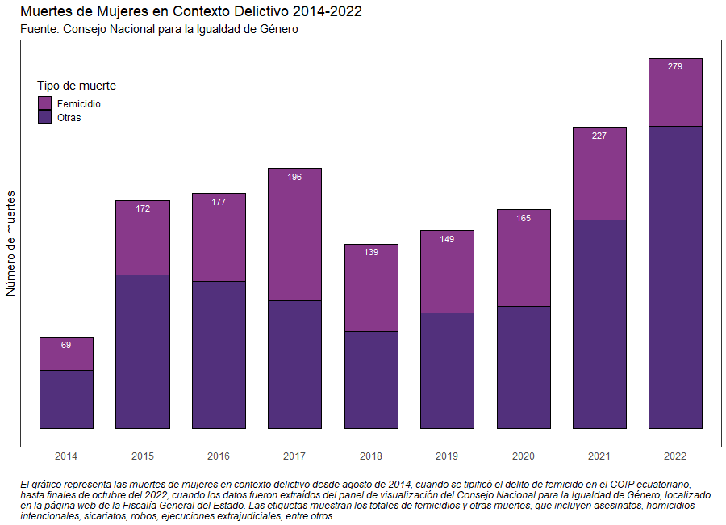
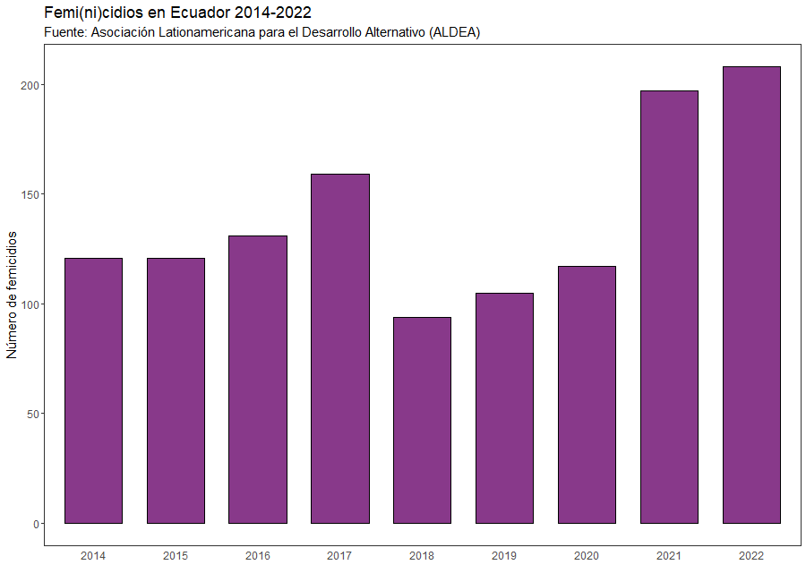
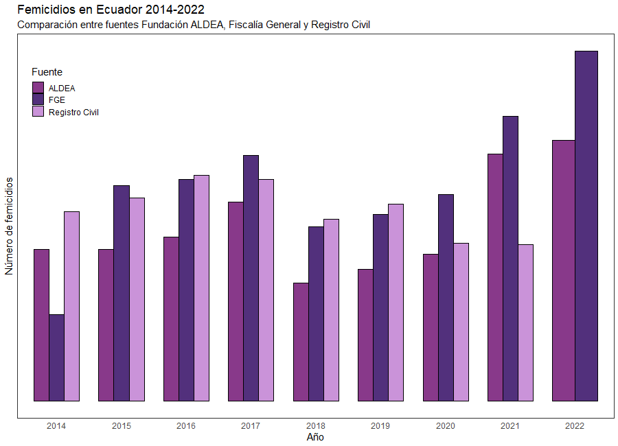

```{r setup, include=FALSE}
# Opciones para todos los chunks
knitr::opts_chunk$set(echo = F)
```

# Muertes Violentas de Mujeres en Ecuador

```{r femicidios-completo-reporte}

```


En Ecuador existe un recuento de muertes violentas de mujeres desde agosto 2014, año en el que se tipificó el delito de femicidio en el Código Orgánico Integral Penal (COIP) - cuerpo de ley que regula el poder punitivo del estado [@códigoo] - hasta finales de 2022, momento en el que los autores recuperaron los datos del [reporte](https://www.fiscalia.gob.ec/analitica-muertes-de-mujeres-en-contexto-delictivo/) presentado periódicamente por el Gobierno Nacional, mediante la Comisión Especial de Estadística de Seguridad, Justicia, Crimen y Transparencia[^1] [-@fiscalía]. Los autores recopilamos esta información del reporte, la cual se puede observar en el gráfico de arriba. Las cifras separan a las muertes de mujeres en dos categorías diferentes, siendo una los *femicidios*, un delito introducido en el COIP de 2014, artículo 141: "la persona que, como resultado de relaciones de poder manifestadas en cualquier tipo de violencia, de muerte a una mujer por el hecho de serlo o por su condición de género"[^2].

[^1]: Esta comisión constituye a varias diferentes instituciones gubernamentales, pero el reporte en cuestión está colgado en la página web de la Fiscalía General del Estado. En adelante, nos referimos a este esfuerzo como simplemente \<\<reporte oficial\>\>.

[^2]: Recuperado de la base metodológica del reporte oficial [-@fiscalía] (párr. 5).

La minoría de muertes violentas de mujeres durante el período constituye este delito, quizás debido a la dificultad de la categorización de la misma. La definición del delito en el COIP sitúa al femicidio como un crimen de odio contra la mujer *por el hecho de serlo*, sin embargo, al ser dificultoso conocer con certeza los motivos verdaderos del criminal, los agentes de la ley se han centrado en aspectos conductuales y sentimentales de las víctimas y/o victimarios para poder sentenciar a los femicidas [-@fiscalía]. Por esta razón sería adecuado considerar que las cifras de femicidios reportados por el gobierno pueden estar considerablemente subestimadas. Sería natural observar las cifras de muertes violentas de mujeres que no han sido categorizados como femicidios para poder superar esa subestimación.

Este gráfico también contempla las cifras de muertes de mujeres en contexto delictivo en categorías ajenas al femicidio. Esta categoría incluye aquellas muertes de mujeres por "homicidios intencionales"[^3], asesinato, sicariato, robo, ejecución extrajudicial, secuestro extorsivo, abandono de persona, violación, acto de odio, abigeato, extralimitación en un acto de servicio, entre otros. Bajo esta aclaración, sería posible llegar a la conclusión que dada la dificultad de la sentencia de un femicidio, buena parte de los *femicidios reales* podrían estar contenidos dentro de esta cifra, pero no podemos saber en qué proporción.

[^3]: Según el reporte del Gobierno, se considera un homicidio intencional a ¨la muerte ilícita causada a una persona con la intención de causarle la muerte o lesiones graves"[@analític2022].

Un hecho notable es que el año 2022, sin haberse terminado aún, presenta un notable aumento respecto al 2021 y es, de hecho, el año con más muertes dentro del período para el que se cuenta con información. Esto sugeriría que el 2022, hasta el momento, ha sido un año especialmente violento para las mujeres. Respecto al 2021, el 2022 presenta alrededor de un 20% más del total de muertes violentas para el año anterior. Este preocupante hallazgo preliminar abre el camino hacia varias preguntas necesarias para caracterizar este incremento, preguntas que son difíciles de responder en la manera en la que se manejan los datos sobre violencia de género en el Ecuador. Eventualmente, si bien algunas de estas preguntas las pudimos responder parcialmente, las conclusiones que pudimos obtener solo dan paso a más preguntas sobre la manera en la que el Ecuador maneja la información sobre delitos violentos y cómo se la utiliza (si ha alguna vez se lo ha hecho) para generar política pública.

# El Problema Estadístico y Organizacional

La posibilidad de que el 2022 sea el año más violento para las mujeres del Ecuador definitivamente ameritó un análisis más profundo, sin embargo, el reporte oficial no provée accesso directo a los datos ni a un documento exhaustivo sobre su metodología de elaboración. Lo poco que se logró conocer es que el aumento en muertes de mujeres en contexto delictivo se debió a muertes que *no* son femicidios, pero debido al problema que mencionamos anteriormente, esto no nos dice mucho.

Nuestra investigación nos llevó al Ministerio de Gobierno, una de las instituciones que participa dentro de la Comisión del reporte oficial, en donde encontramos bases de datos abiertas en los [Indicadores de Seguridad Ciudadana](http://cifras.ministeriodegobierno.gob.ec/comisioncifras/inicio.php) sobre femicidios, homicidios intencionales, entre otros. Pudimos determinar que las cifras de femicidios coinciden al 100% con las cifras del reporte oficial, y se pueden visualizar hasta el 2014 a nivel anual y mensual. Sin embargo, el Ministerio de Gobierno desde el 2014 ha dejado de diferenciar todos las muertes a nivel de género. El filtro de género que hasta el 2013 el Ministerio de Gobierno utilizaba para mostrar la diferencia de muertes entre hombres y mujeres no arroja cifras verdaderas sino valores de "NO DETERMINADO". Esto imposibilita verificar la fuente de las cifras del reporte oficial para las muertes de mujeres de categoría diferente a femicidios, por lo que seguíamos sin tener una manera clara de investigar el aumento de muertes de mujeres en contexto delictivo. La poca seriedad con la que se manejan las bases de datos abiertas al público del Gobierno se hace evidente; esto debido a que se sabe que el Gobierno Nacional sí cuenta con estas bases de datos, pero no las ha puesto a disposición pública.

Si bien el reporte oficial no proporciona la base de datos con la cual genera sus visualizaciones, éste redirecciona al [sitio web de estadísticas](https://www.fiscalia.gob.ec/estadisticas-fge/) de la Fiscalía General del Estado (FGE) en caso de necesitar más información, sin embargo, éste último tampoco pone a disposición pública la base de datos mediante la cual se crean las visualizaciones de la página web. Sin embargo, la FGE dispone de un correo electrónico[^4] para hacer pedidos de información. Realizamos un pedido de información inicial para varios delitos tipificados en el COIP[^5], la cual fue atendida a debido tiempo, pero nos encontramos con varias sorpresas.

[^4]: estadistica\@fiscalia.gob.com

[^5]: Femicidio (Art. 141), Homicidio (Art. 144), Asesinato (Art. 140), Sicariato (Art. 143) y Violación (Art. 171).

En primer lugar, no existe una forma de calcular un número de femicidios por mes o año de la forma en la que se presenta en el Ministerio de Gobierno para esta base de datos, puesto que la base de datos de la FGE tiene una unidad de análisis de denuncias y no de víctima o victimario. Entendiendo esto, no se comprende cómo se realizan las visualizaciones que presenta la FGE en su sitio web de estadísticas, puesto que éstas últimas si presentan un número de femicidios que pueden ser estudiados a nivel mensual y/o provincial.

Si bien la información que se nos envió incluyó información hasta el 2014 para todos los delitos solicitados, se nos dijo que no se podía proporcionar información suficiente para diferenciar víctimas por género, debido a que *en algunos casos las víctimas no son identificadas o son desconocidas y por tanto la variable tiene subregistro.* En lugar de un número de muertes femeninas, como presenta el reporte oficial, la información que nos envió la fiscalía nos *remite un valor porcentual* sin una interpretación clara, puesto a que no existe una explicación exacta sobre la forma en la que este porcentaje se construye en la base de datos. Sigue sin ser clara la manera en la que es calculada la forma en la que se calculan las muertes de mujeres en contexto delictivo del reporte oficial presentado por el Gobierno.

Los analistas de la FGE mencionaron que *se debe observar que la Fiscalía dispone de información de gestión procesal de la justicia. El tema de sentencias corresponde a la Judicatura. Es más, para determinar propiamente al sujeto como víctima o victimario se debe considerar las sentencias.* Esto lleva a entender que la información que la FGE está dispuesta a proporcionar no es suficiente para generar las visualizaciones que ellos presentan (y de acuerdo a sus documentos, también elaboran). Sin embargo, de ser este el caso, debería mencionarse en las visualizaciones, no después de varios días de haber hecho una solicitud de información. Adicionalmente, el Consejo de la Judicatura no cuenta con un sitio web o un correo electrónico específico para pedidos de información estadística. Una vez más, se evidencia una grave falta de seriedad en la administración pública de la información, que ponen en entredicho la veracidad de los datos presentados en reporte oficial.

```{r grafico-denuncias-fge}
knitr::include_graphics('../images/graf6-fge-comparacion.png')
```
De todas maneras, se utilizaron los datos enviados por la FGE para analizar el delito de femicidio desde 2014 a 2022. Como se esperaría con un delito tipificado recientemente, el número de denuncias aumentó de forma empinada con el tiempo, estabilizándose con el tiempo. Se tiene una tasa de crecimiento considerable después de la introducción del delito a la legislación (sobrepasando el 200%), lo que probablemente corresponde a denuncias de femicidios que *no* sucedieron durante ese mismo año. Este es uno de los problemas estadísticos a los que tanto analistas como instituciones públicas se enfrentan analizando datos de delitos: solamente será observable la denuncia, pero no el crimen en sí. Esto genera dos problemas diferentes para nuestros propósitos (1) el número de denuncias dentro de un año puede ser de crímenes cometidos en años anteriores, especialmente las denuncias realizadas en enero (2) existe un gran número de crímenes que jamas se llegan a denunciar. Sin embargo, este problema no es nativo al delito de femicidio. En general, si bien el movimiento de las denuncias contra femicidios se mueve en la misma tendencia que los femicidios provistos por el reporte oficial y el Ministerio de Gobierno, no es posible llegar a conclusiones más profundas que a las que hemos llegado anteriormente.

Debido a estos problemas, decidimos acudir a fuentes externas a las instituciones mencionadas en el reporte oficial. En primer lugar, revisamos la información de defunciones generales de Registro Civil, disponible en el sitio web del [INEC](https://www.ecuadorencifras.gob.ec/defunciones-generales/#:~:text=En%20el%20a%C3%B1o%202021%20se,de%20la%20publicaci%C3%B3n%20es%20anual.). De esta fuente pudimos obtener el número de muertes violentas, en donde si es posible realizar una diferenciación a nivel de género. Sin embargo, el problema aquí es que no existe una categorización de muertes por delito, debido a que el Registro Civil no es una institución enfocada a lo legal. Lo mejor que se puede hacer es realizar una comparación de muertes violentas entre hombres y mujeres, en donde la cifra de muertes violentas de mujeres es comparable al total de muertes de mujeres en contexto delictivo que se puede ver en el primer gráfico. 


No obstante, en el gráfico 3 decidimos incluir la información que nos da el Registro Civil sobre defunciones violentas de mujeres como femicidios. En este gráfico se puede observar que sólo tenemos esta información del año 2011 al 2020. Para el 2020, tenemos un número menor de femicidios en comparación a los años anteriores con un cambio porcentual negativo con respecto al 2019 de 19.75% y el año con una mayor cantidad de este tipo de incidentes es el 2012. Otra vez logramos determinar que los datos varían con respecto a las otras fuentes.



Con el objetivo de tener información de una fuente que no esté controlada o dirigida por el Estado, incluímos a los datos que han sido recopilados por la Asociación Latinoamericana para el Desarrollo Alternativo (ALDEA), "una organización sin fines de lucro conformada por un grupo de mujeres y hombres con alto compromiso para apoyar en la construcción de una sociedad incluyente, equitativa y sustentable" (cita: <http://www.fundacionaldea.org/inicio>). En esta fuente encontramos un [reporte](http://80.241.217.8/mapas_estadisticos/femi_pro/#) del año 2014 al 2022. De acuerdo a estos datos como se puede ver en el gráfico 4, el año 2022 ha sido el que más femicidios ha presentado con un cambio porcentual de 5.58% en comparación al 2021. Cabe recalcar que ALDEA dentro de los femicidios también considera muerte de mujeres por delincuencia organizada y transfemicidios, los cuales hacen referencia al asesinato de hombres que se identifcan con el género femenino (mujeres trans). Las otras instituciones que poseen datos de femicidios en Ecuador no abarcan o al menos no detallan que este tipo de delito (transmeficidio) esté dentro de lo que clasifican como "femicidios". Por esto se esperaría que el número de femicidios presentado por ALDEA sea mayor al de las otras instituciones. Sin embargo al considerar defunciones de mujeres en general como se puede observar en el gráfico 5, ALDEA tiene un menor número de tipo de muerte clasificada como femicidio.

# El Problema de Rendición de Cuentas ?

$mediocridad cuantitativa$


